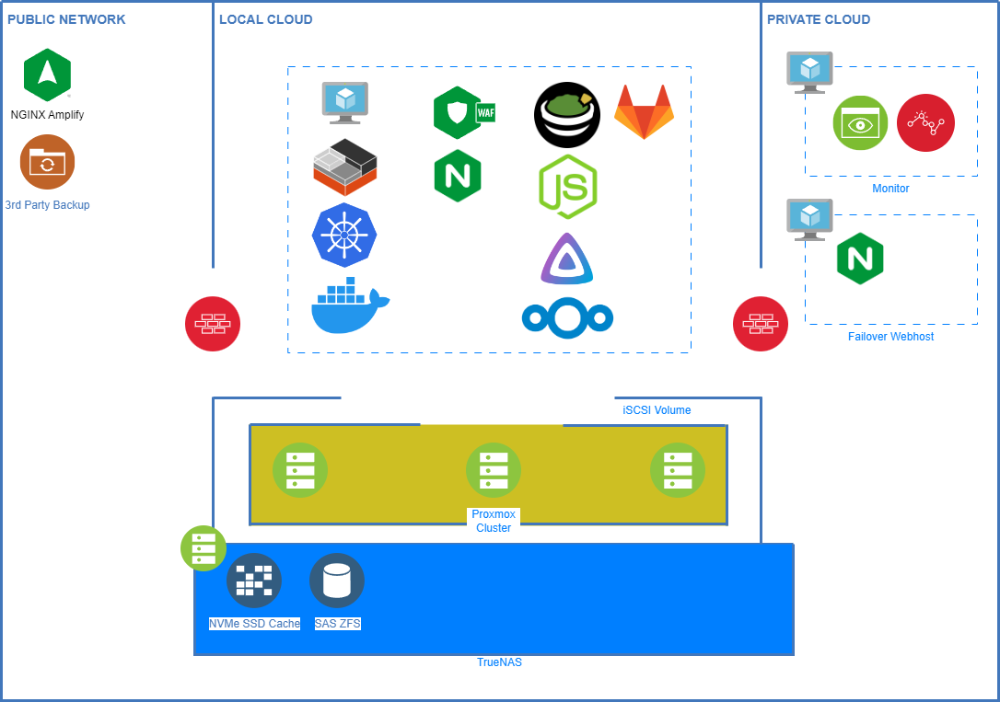
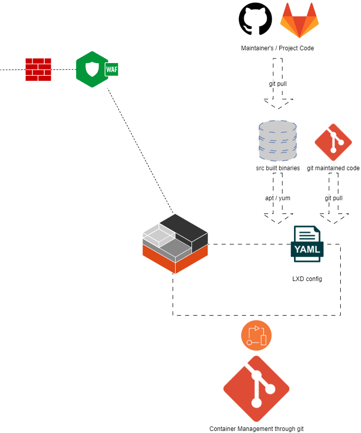

# Homelab
Architectural Design and Configurations for my HomeLab.

## Roadmap

- Migrate current build and deploy legacy process to containers.
- Better failover to Private Cloud.
- 

## Overall Logical Architecture

Hosting Cluster

<picture>
  <source srcset="assets/img/Homelab-Logical.drawio.png">
  
</picture>

## Overall Physical Architecture

<picture>
  <source srcset="assets/img/Homelab-Physical.drawio.png">
  
</picture>

## Build and Deploy Process

The current build and deploy process relies on VM Templates that are maintained through automated processes daily.

When the need for scaling is identified either through monitoring API calls or through manual intervention, a template is cloned and then on boot runs a setup script that pulls packages and code required.

<picture>
  <source srcset="assets/img/qemu-vms.drawio.png">
  
</picture>

This process will be moving to a containerized setup to follow the industry.

The current plan is to utilise both LXD and Docker in place of Template VMs. The overall requirement for storage and hardware will be lowered when using LXD and Docker, but the learning curve for this process is steeper.

<picture>
  <source srcset="assets/img/docker-devops.drawio.png">
  
</picture>
<picture>
  <source srcset="assets/img/lxd-devops.drawio.png">
  
</picture>

## Archive(s)
-------------

## Acknowledgements:
--------------------
I would like to acknowledge the following Free and Open Source Softwares that make the Internet function.
Specifically, I use and recommend the following:

All Diagrams are generated with [Diagram.net  (Draw.io)](https://Diagrams.net)

#### FOSS Used:

UNIX
- [FreeBSD](https://freebsd.org/)

Linux
- [Debian](https://debian.org/)
- [Ubuntu](https://ubuntu.com/)
- [CentOS](https://centos.org)
- [RockyLinux](https://rockylinux.org/)
- [Red Hat Linux](https://redhat.com/en/technologies/linux-platforms) [^1]
- [Fedora](https://getfedora.org/)

[7-Zip](https://7-zip.org)

[Gitlab](https://gitlab.com)

[rclone](https://rclone.org)

[QEMU](https://qemu.org)

Kernel-based Virtual Machine (KVM)

[LXC/LXD](https://linuxcontainers.org)

---

[^1]: Red Hat Enterprise Linux is not FOSS for production use, but they offer a Developer Edition.